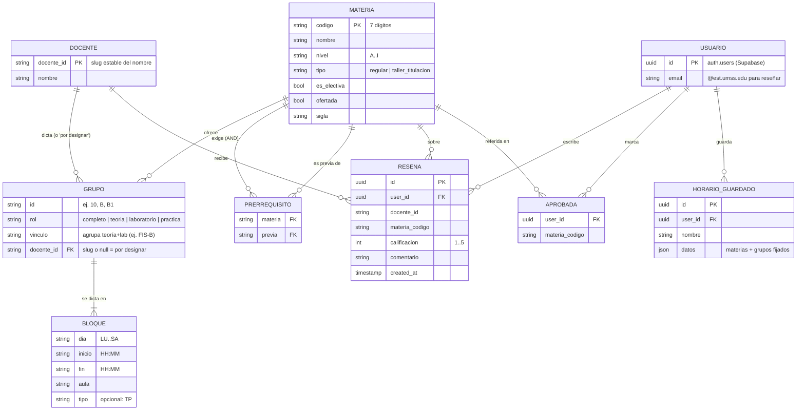
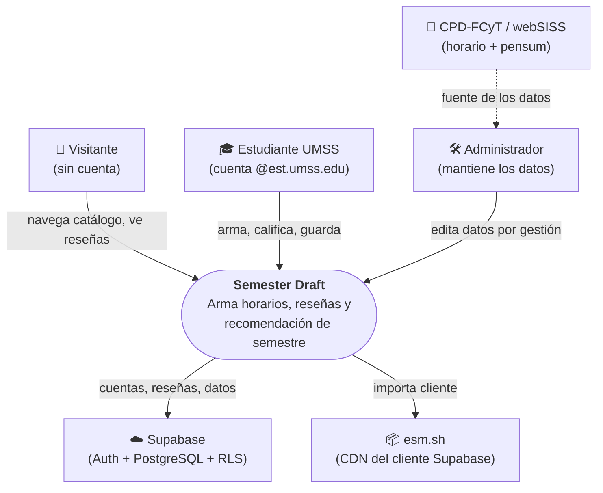
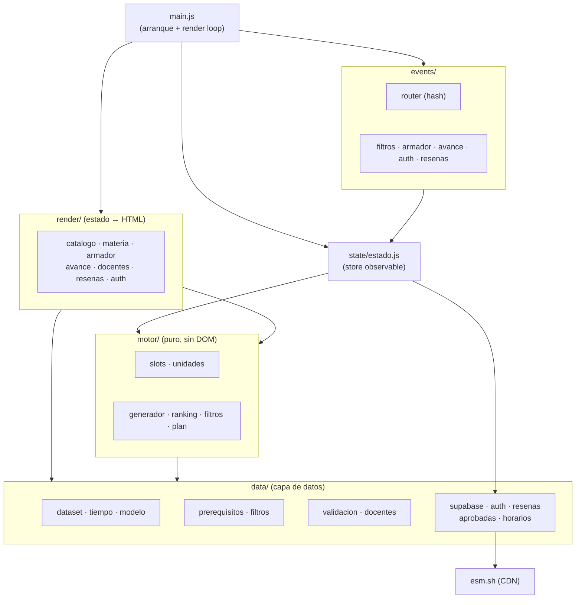

# Documentación técnica — Semester Draft

Artefactos de diseño que la Especificación marcaba como *“evidencia a completar
durante el desarrollo”*: modelo entidad–relación y diagramas de arquitectura (C4).
Los diagramas usan **Mermaid** (se renderizan en GitHub y en VS Code con la
extensión de Markdown Preview Mermaid).

> **Dos planos de datos.** El **catálogo** (horario + pensum) vive como **JSON
> estático** versionado (no es base de datos); la **persistencia** (cuentas,
> reseñas, aprobadas, horarios guardados) vive en **Supabase (PostgreSQL)**.

---

## 1. Modelo Entidad–Relación (ERD)



**Reglas clave del modelo**
- Una materia se **habilita** cuando *todas* sus previas (`PRERREQUISITO`) están aprobadas (AND).
- `vinculo` modela teoría + laboratorio como **paquete** (selección válida = 1 teoría + 1 lab del mismo vínculo, p. ej. Física General).
- `RESENA` es única por `(user_id, docente_id, materia_codigo)` y **anónima** hacia otros (se lee por vistas sin `user_id`).
- `docente_id` es un **slug** del nombre: estable ante correcciones de acento.

---

## 2. Arquitectura — C4

### Nivel 1 · Contexto



### Nivel 2 · Contenedores

```mermaid
graph TD
    subgraph navegador["🌐 Navegador del estudiante"]
        spa["<b>SPA</b> — Vanilla JS + ES6<br/>(sin build)"]
        json["📁 Datos del catálogo<br/>horario-1-2026.json (estático)"]
    end

    pages["🚀 GitHub Pages<br/>(hosting estático)"]
    supabase["☁️ Supabase<br/>Auth · PostgreSQL · RLS"]
    cdn["📦 esm.sh (CDN)"]

    pages -->|sirve HTML/CSS/JS + JSON| spa
    spa -->|fetch| json
    spa -->|REST/Auth (HTTPS)| supabase
    spa -->|import dinámico| cdn
```

### Nivel 3 · Componentes (dentro de la SPA)



**Principios de la arquitectura**
- **Datos como configuración** (D1): horario y pensum se editan como datos, sin tocar lógica.
- **Motor puro sin DOM**: testeable en Node; la UI lo consume, nunca al revés.
- **Cliente Supabase perezoso**: se importa del CDN solo al usar auth/reseñas, así el catálogo y el armador funcionan aunque el CDN falle.
- **Sin dependencias ni build**: Vanilla JS + módulos ES6.
